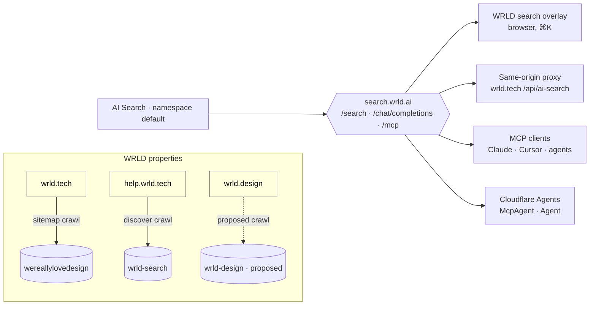

# AI Search, MCP and agents on WRLD properties

> The company-wide guideline for putting Cloudflare AI Search, its MCP endpoint and Cloudflare Agents into WRLD projects and internal systems, public and private. Load `brand/CLAUDE.md` first for voice and casing. This document is served at <https://wrld.design/docs/AI_SEARCH_AGENTS.md> and linked from `/llms.txt`, `/.well-known/api-catalog` and the **API / MCP / Agents** card on wrld.design.

**Owner:** Ridgeway Lawrence (@Ridgelawrence) · **Accounts:** Curtis Carney (@cowboyspice) · **Status:** v1.0, 2026-09-30 · **Source of truth:** `WRLDInc/DesignSystem`, this file.

---

## 1. The one-paragraph version

Every WRLD property gets search, answers and an agent tool from **one Cloudflare AI Search namespace endpoint**, not from a search library of its own. Public properties call the endpoint from the browser through the WRLD search overlay (the ⌘K dialog specified in §5). Internal systems and client portals use the same product behind a **custom domain with Cloudflare Access**, or a **Workers binding** inside their own Worker. Agents reach the same content through the endpoint's built-in **`/mcp`** route, and richer agents are built with the **Cloudflare Agents SDK** on top of an `ai_search_namespaces` binding. Every property also ships the **web rules and metadata** in §7 so the crawler, the search overlay and third-party agents all see the same, correctly labelled content.



## 2. Inventory (verified against the WRLD Inc. account, 2026-09-30)

All instances live in the account's `default` namespace today. The namespace exposes one public endpoint; two instances also expose their own.

| Object | Value | Notes |
| --- | --- | --- |
| Namespace public endpoint | `https://search.wrld.ai` (custom domain) · fallback `https://ns-5ad016c9-354a-41a1-86c0-4b5625fb4e37.search.ai.cloudflare.com` | Paths `/search`, `/chat/completions`, `/mcp`. Default hostname enabled. |
| `instances_allowed` | `wereallylovedesign`, `wrld-search` | One request searches both and merges the chunks; each chunk carries `instance_id`. |
| Authorized hosts (CORS) | `wrld.ai`, `*.wrld.ai`, `wrld.tech`, `*.wrld.tech`, `wrld.help`, `wrld.host`, `*.wrld.host`, `*.wrldtech.workers.dev`, `*.wrld.dev`, `wrld.dev` | **`wrld.design` is missing** — see §3.3. **Wildcard entries do not match on the preflight** (verified 2026-09-30: `foo.wrld.tech`, `www.wrld.host` and a `*.wrldtech.workers.dev` preview get no `access-control-allow-origin`; exact `wrld.tech`, `wrld.help`, `wrld.dev` do). Treat the list as exact hostnames. Browser-only control; `curl` ignores it. |
| Rate limit | not set on the namespace endpoint | Set one before wide promotion (§8). |
| Instance `wereallylovedesign` | web crawler · source `wrld.tech` · parse `sitemap` · vector only · `@cf/qwen/qwen3-embedding-0.6b` · answers with `@cf/zai-org/glm-5.3` · cache 3 days (`close_enough`) · sync every 6 h | Own public endpoint `74a319b2-7688-483d-aaf8-ccbf087c98dd` with custom domain `search.wrld.tech` (that hostname still answers `400` from another product — DNS was never moved; either move it or remove the custom domain). Authorized hosts on this instance already include `wrld.design` and `wrld.help`. |
| Instance `wrld-search` | web crawler · source `help.wrld.tech` · parse `sitemap` + discover (depth 1000, subdomains) · **hybrid** vector + keyword · reranking · query rewrite · `@cf/zai-org/glm-4.7-flash` · sync every 6 h | Own public endpoint `dfd00a62-cb04-4bb0-9253-8c95b3c04a89`. NLWeb worker `wrld-search-nlweb.wrldtech.workers.dev`. |
| Instance `ancient-glade-012e` | web crawler · source `affordacareinsurance.com` (client) | A client instance in the WRLD namespace. §4.1 says it belongs in its own namespace; migrate when convenient. |
| MCP | `https://search.wrld.ai/mcp` (Streamable HTTP) | Tool `search`. Registered in `WeReallyLoveDesign/.mcp.json`; every WRLD repo should carry the same entry (§6.3). |
| UI snippet library | `https://search.wrld.ai/assets/v0.0.40/search-snippet.es.js` | Pinned. `search-bar-snippet`, `search-modal-snippet`, `chat-bubble-snippet`, `chat-page-snippet`. |

Read the live configuration before changing anything — `public_endpoint_params` is **replaced in full** on every `PUT` (§8.2):

```bash
curl -s "https://api.cloudflare.com/client/v4/accounts/$CF_ACCOUNT_ID/ai-search/namespaces/default" \
  -H "Authorization: Bearer $CLOUDFLARE_API_TOKEN" | jq .result.public_endpoint_params
curl -s "https://api.cloudflare.com/client/v4/accounts/$CF_ACCOUNT_ID/ai-search/namespaces/default/instances" \
  -H "Authorization: Bearer $CLOUDFLARE_API_TOKEN" | jq '.result[] | {id,type,source,public_endpoint_id,public_endpoint_params}'
```

## 3. Namespaces and instances — the rules

### 3.1 Namespaces

| Namespace | Holds | Public endpoint |
| --- | --- | --- |
| `default` | WRLD-owned public properties only: wrld.tech, help.wrld.tech, wrld.design, wrld.host docs, WRLD.AI marketing | Yes — `search.wrld.ai`, all three paths |
| `wrld-internal` (create when needed) | Internal knowledge: runbooks, Craft exports, SOPs | Yes, **behind Cloudflare Access** on `search-internal.wrld.tech`, default hostname off |
| `client-<slug>` (one per client) | That client's sites and documents, e.g. `client-affordacare` | Per client; never mixed with WRLD content |

Why: the namespace endpoint's `instances_allowed` is a merge list. Anything in the same namespace is one config edit away from appearing in wrld.tech search results. Client and internal content never shares a namespace with public marketing content.

### 3.2 Instance naming and settings

- Name: `<property>-<source>` in kebab-case — `wrld-tech-site`, `wrld-help-docs`, `wrld-design-system`. The two legacy names (`wereallylovedesign`, `wrld-search`) stay; renaming means recreating.
- One instance per crawl root. Do not point one crawler at two hostnames.
- Docs and help content: turn on **hybrid search**, **reranking** and **query rewriting** (the `wrld-search` profile). Marketing content: vector only is fine (the `wereallylovedesign` profile).
- Keep `@cf/qwen/qwen3-embedding-0.6b` as the embedding model across the namespace; mixed embedding models in one merge list make scores incomparable.
- `score_threshold` 0.4, `max_num_results` 10, chunk 1024 / overlap 10 unless a measured reason says otherwise.
- Sync every 6 h; trigger a re-crawl after any content launch (§8).
- **Tool description** (Settings → Public Endpoint) is mandatory and specific. Not the default "Finds exactly what you're looking for". Template: *"Search <property> — <what is indexed>. Use it when a user asks about <topics>. Returns page titles, URLs and excerpts from wrld.tech content only."*

### 3.3 Enabling a new WRLD host on the namespace endpoint

Authorized hosts are CORS. Add **every exact hostname** that will call the endpoint from a browser — the wildcards in the list are stored but not honoured on the preflight (verified 2026-09-30), so a branch preview needs its own exact entry while it is under review, removed afterwards. Write it **without dropping any other field**:

```bash
# 1. read
cur=$(curl -s "https://api.cloudflare.com/client/v4/accounts/$CF_ACCOUNT_ID/ai-search/namespaces/default" \
  -H "Authorization: Bearer $CLOUDFLARE_API_TOKEN" | jq .result.public_endpoint_params)
# 2. append the host, keep everything else
body=$(echo "$cur" | jq '{public_endpoint_params: (.authorized_hosts += ["wrld.design"] | .)}')
# 3. write the complete object
curl -s -X PUT "https://api.cloudflare.com/client/v4/accounts/$CF_ACCOUNT_ID/ai-search/namespaces/default" \
  -H "Authorization: Bearer $CLOUDFLARE_API_TOKEN" -H "Content-Type: application/json" -d "$body"
# 4. verify: the preflight must echo the origin
curl -si -X OPTIONS https://search.wrld.ai/search -H "Origin: https://wrld.design" \
  -H "Access-Control-Request-Method: POST" | grep -i access-control-allow-origin
```

**Open item (2026-09-30):** `wrld.design` is not yet in the namespace list, so the overlay on the apex shows its "temporarily unavailable" state until step 3 runs. Step 3 is an account change and is left to @Ridgelawrence. The `*.wrldtech.workers.dev` wildcard is listed but does not match, so branch previews show the same state until their exact hostname is added. wrld.tech never hits this because its proxy sends `Origin: https://wrld.tech` server-side.

## 4. Public vs private use

### 4.1 Decision table

| You are building | Use | Why |
| --- | --- | --- |
| A public site with no server (assets-only Worker, static host) — wrld.design | Browser → namespace endpoint directly, WRLD overlay + pinned snippets | Zero Worker invocations, CORS already the control. |
| A public site with a Worker — wrld.tech | Browser → same-origin proxy → namespace endpoint | Proxy bounds payload, strips visitor headers, turns all-instance failures into a 503 the UI understands. Pattern: `WeReallyLoveDesign/site/src/pages/api/ai-search/[...action].ts`. |
| A client portal or internal tool (people) | Custom domain on its own namespace endpoint, **Cloudflare Access** in front, `default_domain_enabled: false` | Turns the public endpoint into an internal one without writing auth. Access CORS settings needed for cross-origin pages. |
| A Worker, Agent or backend that queries content | `ai_search` (one instance) or `ai_search_namespaces` (whole namespace) binding, `"remote": true` | No public URL at all. Bindings are remote-only: every build environment needs `CLOUDFLARE_API_TOKEN` or `wrangler dev` / prerender fails (verified on wrld.tech, 2026-09-22). |
| MCP clients and scripts against a protected endpoint | Access **service token** as `CF-Access-Client-Id` / `CF-Access-Client-Secret` headers | Non-browser clients cannot complete an interactive login. |

Never ship a Cloudflare API token to a browser. Never use the REST API (`api.cloudflare.com/.../search`) from client code. The public endpoint exists so that you do not have to.

### 4.2 Request and response shapes (public endpoint)

`POST /search` — chunks only, no generation:

```json
{
  "messages": [{ "role": "user", "content": "design tokens" }],
  "ai_search_options": {
    "instance_ids": ["wereallylovedesign"],
    "retrieval": { "metadata_only": true, "max_num_results": 10,
                   "filters": { "wrld_audience": "public" } }
  }
}
```

Observed response (2026-09-30) — note the endpoint answers **unwrapped**; the REST API wraps the same object in `result`. Read both:

```json
{
  "query_kind": "search", "search_query": "design tokens",
  "chunks": [{
    "id": "…", "type": "text", "score": 0.52, "text": "",
    "item": { "key": "https://wrld.tech/blog/…/", "timestamp": 1789785780000,
              "metadata": { "title": "…", "description": "…", "image": "https://…png", "chunk_modality": "text" } },
    "instance_id": "wereallylovedesign"
  }],
  "errors": []
}
```

`chunks: []` **with** entries in `errors` is an outage, not an empty result — show the unavailable state (§5.4). `chunks` plus `errors` is a partial failure — show the results.

`POST /chat/completions` with `"stream": true` — `text/event-stream`: an `event: chunks` frame with the retrieved sources first, then OpenAI-style `data: {"choices":[{"delta":{"content":"…"}}]}` frames, then `data: [DONE]`. Without `stream` it returns one OpenAI-compatible JSON body. The instance owns model selection; do not pass `model` from a browser.

`POST /mcp` — JSON-RPC 2.0, Streamable HTTP. Send `Accept: application/json, text/event-stream` or the endpoint answers `406`. One tool, `search`, argument `{ "query": "…" }`.

### 4.3 Filters you can rely on

Filtering uses metadata attributes indexed per chunk. Built-ins: `folder`, `timestamp`, `filename`; custom fields come from `<meta>` tags (§7.2). Operators `$eq $ne $in $nin $lt $lte $gt $gte`; multiple keys are AND; filters match the first 64 UTF-8 bytes of a string. "Starts with" a path is a range: `{ "folder": { "$gte": "docs/", "$lt": "docs0" } }`.

## 5. The WRLD search overlay — interface and specs

This is the interface every WRLD property ships. wrld.tech's `AISearch.astro` is the first implementation; wrld.design's `deploy/index.html` is the static one; `registry/blocks/wrld-search-dialog.tsx` is the React port for shadcn hosts. The reference card is `preview/agents-search-overlay.html`, listed on `/system#agents`.

### 5.1 Anatomy

| # | Part | Spec |
| --- | --- | --- |
| 1 | **Trigger** | 40 px round icon button in the nav's tool cluster (beside the theme button), Lucide `search` 18 px / 1.5 stroke, `aria-haspopup="dialog"`, `aria-keyshortcuts="Meta+K Control+K"`, `title="Search WRLD (⌘K)"`. Hover: accent colour on icon + border, accent shadow. Never a full-width input in a marketing nav. |
| 2 | **Dialog** | Native `<dialog>`, `min(820px, 100vw − 1.25rem)` wide, `max-height: 100dvh − 1.25rem`, radius `--wrld-radius-md` (8 px), 1 px border `--wrld-border-strong` mixed 18 % with the primary accent, background `--wrld-bg` at 92 % + 18 px blur, backdrop `--wrld-mono-950` at 72 % + 8 px blur. Fullscreen toggle (Lucide `maximize` / `minimize`). |
| 3 | **Heading** | Eyebrow `Search · Discover · Ask` (mono 12 px, `--wrld-fg-muted`), `h2` **WRLD.AI** (display 20 px / 600 / −0.02 em). Close button, 38 px, same style as the trigger. |
| 4 | **Tabs** | `role="tablist"`: **Search** and **Ask WRLD.AI**, each with a 24 px bordered icon box (`search`, `message-square-plus`). Selected tab: `--wrld-fg`, open-bottomed border resting on the tablist rule, no bottom padding on the list. Arrow / Home / End keys move between tabs. |
| 5 | **Notice row** | `role="status" aria-live="polite"`: loading, outage and retry copy live here, never in a toast. |
| 6 | **Panels** | Search: `search-bar-snippet` (or the React list) — result rows with title (body 14 px / 500), URL (mono 11 px, `--wrld-fg-subtle`), description (13 px, `--wrld-fg-muted`), and an **instance chip** (mono 10 px uppercase: `wrld.tech`, `help`) so merged results are attributable. Ask: `chat-page-snippet` (or the React stream) with sources listed above the answer. |
| 7 | **Footer** | `Answers from WRLD content. Check sources before acting.` left; `Esc to close` right (`<kbd>`, mono). |

### 5.2 Tokens and the snippet variable map

Static surfaces stay monochrome; the accent appears on hover and focus only. Map Cloudflare's variables exactly like this (wrld.tech does):

```css
search-bar-snippet, chat-page-snippet {
  --search-snippet-font-family: var(--wrld-font-body);
  --search-snippet-font-family-mono: var(--wrld-font-mono);
  --search-snippet-background: var(--wrld-bg);
  --search-snippet-surface: var(--wrld-bg-subtle);
  --search-snippet-text-color: var(--wrld-fg);
  --search-snippet-text-secondary: var(--wrld-fg-muted);
  --search-snippet-text-description: var(--wrld-fg-muted);
  --search-snippet-border-color: var(--wrld-border);
  --search-snippet-primary-color: var(--wrld-fg);          /* not the accent */
  --search-snippet-primary-hover: var(--wrld-accent-primary);
  --search-snippet-hover-background: var(--wrld-bg-muted);
  --search-snippet-user-message-bg: var(--wrld-bg-muted);
  --search-snippet-assistant-message-bg: var(--wrld-bg-subtle);
  --search-snippet-border-radius: var(--wrld-radius-sm);
  --search-snippet-animation-duration: var(--wrld-duration-default);
}
```

Known v0.0.40 gaps and the required fixes (adopt a stylesheet into each open shadow root once the elements register; fall back to a `<style>` child where constructable stylesheets are missing):

- Primary buttons hard-code a white label. With primary = `--wrld-fg` they vanish in dark mode. Add `.button:not(.button-secondary), .new-chat-button, .chat-message-avatar { color: var(--wrld-fg-inverse) }` and `--wrld-mono-0` on hover.
- `chat-page-snippet` has no responsive rules; under 600 px its 280 px history sidebar squeezes the conversation. Make `.chat-sidebar` an absolute overlay that starts collapsed (through the widget's own toggle so its state stays true).
- Search errors emit no event. Observe the shadow root for `.error` and replace the transport text with the copy in §5.4.

### 5.3 Behaviour

- Open on the trigger and on **⌘K / Ctrl K** (never Alt). Close on Esc, the close button, a click on the backdrop, and after navigation. Return focus to the element that opened it (or the trigger when that element is hidden).
- Lock page scroll while open (`html { overflow: hidden }`, restored on close).
- Load the snippet script on **first open**, not at page load; 15 s timeout → the load-failure notice with **Try again** and **Talk to WRLD** (`/contact`).
- Theme follows the page's `data-theme` (`auto | light | dark`) through the snippet's `theme` attribute; observe `data-theme` for changes.
- `prefers-reduced-motion`: no transitions, `--search-snippet-animation-duration: 0ms`.
- Analytics off (`disable-analytics="true"`). Chat history is the widget's localStorage; its own controls clear it. Log upstream HTTP status and failed `instance_id`s only — never prompts or provider error bodies.
- Copy is sentence case; no emoji; the tab is "Ask WRLD.AI", the product name is WRLD.AI.

### 5.4 Copy for every state

| State | Copy |
| --- | --- |
| Loading script | `Loading WRLD.AI…` |
| Loading results (widget) | `Searching WRLD…` · `Finding relevant pages…` |
| Empty search | `What are you looking for?` / `Find services, guides, and ideas from WRLD.` |
| No results | `No matching pages` |
| Search outage (all instances failed) | `Search is temporarily unavailable. Please try again later or contact WRLD.` |
| Script failed | `WRLD.AI could not load. Try again or talk to our team.` + **Try again** + **Talk to WRLD** |
| Chat empty | `Ask WRLD.AI` / `Ask about our services or explore an idea for your business.` |
| Chat outage | `WRLD.AI is temporarily unavailable. Please try again later or talk to our team.` |
| Footer | `Answers from WRLD content. Check sources before acting.` |

## 6. Agents

### 6.1 Which kind

| Need | Build |
| --- | --- |
| "Let Claude / Cursor / an assistant search our content" | Nothing. Point the client at `https://search.wrld.ai/mcp` (§6.3). |
| Domain tools next to search (create a ticket, look up a plan, read a status page), with state per user | **`McpAgent`** from the Agents SDK — a Durable Object per session, tools registered on an `McpServer`, AI Search reached through an `ai_search_namespaces` binding. Reference: `agents/wrld-search-agent/`. |
| Stateless tools, no per-session memory | `createMcpHandler(createServer)` from `agents/mcp/server` in a plain Worker. |
| A conversational agent in a WRLD product (WRLD.AI dashboard) | `Agent` subclass with `@callable()` methods; `this.env.AI_SEARCH.get("<instance>").search()` before the model call. |

### 6.2 The reference agent

`agents/wrld-search-agent/` is a copy-and-rename skeleton: `wrangler.jsonc` (Durable Object binding + SQLite migration + `ai_search_namespaces` with `remote: true`), `src/index.ts` (one `search_wrld` tool that queries an instance and returns titles, URLs and excerpts as text, and a `list_wrld_properties` tool), and `.mcp.json` for clients. It is a reference, not a deployed service: when a project adopts it, pin the package versions on first install and run the project's own tests.

Rules for any WRLD agent:

- Tool names are `snake_case` verbs with a WRLD prefix where they leave the project (`search_wrld`, `open_wrld_ticket`). Descriptions say what content or system the tool reaches and when to use it.
- Results are text with the URL on its own line, so any client can cite them. No HTML in tool results.
- Bindings are declared in `wrangler.jsonc`, never only in the dashboard: a dashboard-only binding is a destructive diff on the next `wrangler deploy` (wrld.tech lost its deploys to exactly this on 2026-09-19).
- Observability on; logs never contain prompts.
- Anything a person would need to log in for goes behind Access or the WRLD identity flow in `auth.md`, never behind an API token in the agent.

### 6.3 MCP client registration (every WRLD repo)

```json
{
  "mcpServers": {
    "wrld-search": { "type": "http", "url": "https://search.wrld.ai/mcp" }
  }
}
```

Commit this as `.mcp.json` so Claude Code, Cursor and the design tooling see the same tool. For a protected endpoint add the Access service-token headers under `headers`.

## 7. Web rules and metadata every property ships

The crawler, the overlay and third-party agents read the same signals. Ship all of them; the build should fail when one goes missing (wrld.design's `scripts/build_site.mjs` does).

### 7.1 Files and headers

| Surface | Rule |
| --- | --- |
| `robots.txt` | Carries a `Content-Signal:` line with the property's policy. Documentation properties (wrld.design, help.wrld.tech): `search=yes, ai-input=yes, ai-train=yes`. Marketing properties decide per site and write the reason in the file (wrld.tech opts out of training). Preview hosts answer `X-Robots-Tag: noindex`. |
| `sitemap.xml` | Complete and canonical (200 URLs only, no redirects). The `sitemap` parse type indexes **only** what the sitemap lists; a page outside it does not exist to search. |
| `llms.txt` | The llmstxt.org overview, linking every machine-readable surface including this document and the MCP URL. |
| `/.well-known/api-catalog` | RFC 9727 linkset. Include an anchor for `https://search.wrld.ai/` that points at this guideline. |
| `/.well-known/agent-skills/index.json` | Skills with digests, generated at build so the digest cannot go stale. |
| `/.well-known/oauth-protected-resource` + `auth.md` | Only where the property has an authenticated door (see `docs/LOGIN_DESIGN.md`). |
| `Link` headers on `/` | `api-catalog`, `service-desc`, `service-doc`, `describedby`. |
| `.mcp.json` in the repo | §6.3. |

### 7.2 Page metadata schema (custom metadata, max five fields per instance)

Define this schema on every WRLD instance (Settings → Indexing → Metadata) and emit the tags on every page. Names are matched case-insensitively; use underscores, not colons.

```html
<meta name="title" content="Design tokens — WRLD.design">
<meta name="description" content="156 tokens, three themes, every one with a usage note.">
<meta property="og:image" content="https://wrld.design/logos/favicons/android-chrome-512x512.png">
<meta name="wrld_property" content="wrld.design">          <!-- string · which property -->
<meta name="wrld_section"  content="foundations">          <!-- string · nav section / topic -->
<meta name="wrld_audience" content="public">               <!-- string · public | client | internal -->
<meta name="wrld_updated"  content="1790726400">           <!-- number · unix seconds -->
<meta name="wrld_kind"     content="doc">                  <!-- string · doc | product | blog | support | policy -->
```

`title`, `description` and `image` are the built-ins (standard tag wins over Open Graph). The five `wrld_*` fields are the whole custom budget — do not add a sixth for one site. Filter examples: `{ "wrld_audience": "public" }`, `{ "wrld_kind": { "$in": ["doc", "support"] } }`, `{ "wrld_updated": { "$gte": 1780000000 } }`.

### 7.3 Content hygiene for the crawler

- Use content selectors to exclude nav, footer, cookie banners and the search dialog itself from indexing; otherwise every page's chunk begins with the same menu.
- One canonical URL per page; the crawler stores `item.key` as the URL it fetched.
- Keep `/api/`, `/preview/` iframes and any `noindex` route out of the sitemap and behind path filters.
- Published PDFs and one-page exports (the design system's `WRLD Design System.html`) are too large or too repetitive to chunk well — exclude them.

## 8. Operations

### 8.1 Checklist for a new WRLD project

1. Decide the row in §4.1. Public site → namespace endpoint; internal → Access; backend → binding.
2. Instance: name per §3.2, right profile (docs vs marketing), tool description written, metadata schema from §7.2 defined, sync 6 h.
3. Namespace: correct one (§3.1). Add the instance to `instances_allowed` only if its content belongs in the merged public search.
4. Authorized hosts: every exact browser hostname (wildcards do not match), added with the read-append-write flow in §3.3. Verify the preflight echoes each origin.
5. Rate limit set (120 requests / minute / fixed is the sane start).
6. Overlay per §5, tokens from `styles.css`, snippet pinned to `v0.0.40` (bump deliberately, re-check the §5.2 gaps).
7. Web rules per §7.1, metadata per §7.2, `.mcp.json` committed.
8. Verify: `POST /search` returns chunks with the right `instance_id`; `/chat/completions` streams; `/mcp` answers `tools/list`; `isitagentready.com` scan of the apex.
9. Record the instance and endpoint in the table in §2 (this file) and in the project's Craft page.

### 8.2 Change control

- `public_endpoint_params` is replaced in full on every `PUT`. Always GET, modify, PUT the complete object. Omitting `instances_allowed` empties it; omitting `default_domain_enabled` re-enables the unauthenticated hostname.
- Configuration lives in the dashboard **and** is recorded here after every change (date, who, what). A config that is not in this table does not exist.
- Re-crawl after content launches: dashboard → instance → **Sync now**, or `npx wrangler ai-search sync <instance>`.
- If `chunks: []` + `errors: [{ "message": "All search methods failed: vector" }]` becomes frequent, check the instance's index status and AI Gateway credits in the account before touching the site.
- Snippet upgrades: read the changelog of `cloudflare/ai-search-snippet`, re-test the three §5.2 gaps and the dark-mode label contrast (≥ 4.5:1) before bumping the pinned version anywhere.

### 8.3 Verification commands

```bash
# merged search, attributable chunks
curl -s https://search.wrld.ai/search -H 'Content-Type: application/json' \
  -d '{"messages":[{"role":"user","content":"managed IT"}],"ai_search_options":{"retrieval":{"metadata_only":true,"max_num_results":3}}}' \
  | jq '.chunks[] | {instance_id, url: .item.key, title: .item.metadata.title}'

# streamed answer
curl -sN https://search.wrld.ai/chat/completions -H 'Content-Type: application/json' -H 'Accept: text/event-stream' \
  -d '{"messages":[{"role":"user","content":"What does WRLD.Services include?"}],"stream":true}' | head -20

# MCP tool list
curl -s https://search.wrld.ai/mcp -H 'Content-Type: application/json' -H 'Accept: application/json, text/event-stream' \
  -d '{"jsonrpc":"2.0","id":1,"method":"tools/list"}'

# CORS for a host
curl -si -X OPTIONS https://search.wrld.ai/search -H 'Origin: https://wrld.design' -H 'Access-Control-Request-Method: POST' | grep -i allow-origin
```

## 9. Related

- `docs/LOGIN_DESIGN.md` — the authenticated door; `auth.md` — how agents get credentials.
- `docs/CLOUDFLARE_DEPLOY.md` — wrld.design's deploy runbook, including the agent-discovery checks.
- `WeReallyLoveDesign/docs/AI_SEARCH.md` — wrld.tech's implementation notes (proxy, snippet fixes, deploy incident).
- Cloudflare: [AI Search public endpoint](https://developers.cloudflare.com/ai-search/api/search/public-endpoint/) · [Namespace public endpoints](https://developers.cloudflare.com/ai-search/configuration/retrieval/public-endpoint/namespace/) · [Custom domains](https://developers.cloudflare.com/ai-search/configuration/retrieval/public-endpoint/custom-domains/) · [Cloudflare Access](https://developers.cloudflare.com/ai-search/configuration/retrieval/public-endpoint/cloudflare-access/) · [UI snippets](https://developers.cloudflare.com/ai-search/configuration/retrieval/public-endpoint/embed-search-snippets/) · [MCP](https://developers.cloudflare.com/ai-search/api/search/mcp/) · [Custom metadata](https://developers.cloudflare.com/ai-search/configuration/data-source/website/custom-metadata/) · [Filtering](https://developers.cloudflare.com/ai-search/configuration/retrieval/filtering/) · [Agents SDK: AI Search tool](https://developers.cloudflare.com/agents/tools/ai-search/) · [McpAgent](https://developers.cloudflare.com/agents/model-context-protocol/).
