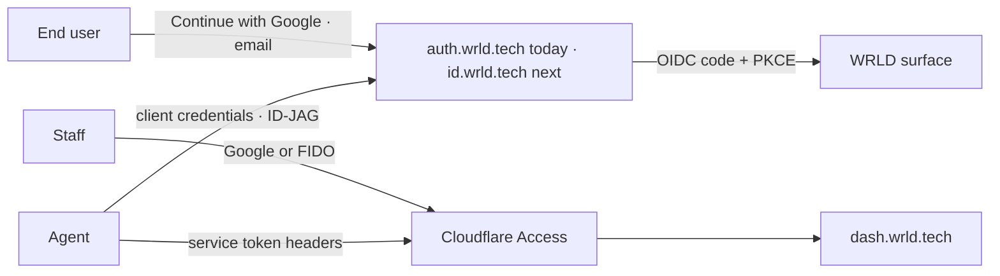

# Login design guidelines

How a WRLD sign-in surface is built: which identity provider fronts which
door, what the page looks like, which tokens it uses, and what an agent
implementing it must and must not do. This is the guideline that
[`auth.md`](https://wrld.design/auth.md) points authorised agents at. The reference card
is [`preview/components-login.html`](../preview/components-login.html), served
at <https://wrld.design/preview/components-login>.

Read [`README.md`](../README.md) and [`brand/CLAUDE.md`](../brand/CLAUDE.md)
first. Nothing here overrides them; this document applies them to one moment.

## 1. Which door, which provider

A WRLD product never rolls its own credential store. Sign-in is delegated to
the identity provider that owns the door, and the page is themed, not
rebuilt.

| Surface | Audience | Provider today | Provider when CentralizeWRLD phase 2 lands | Pattern |
| --- | --- | --- | --- | --- |
| Client portals (WRLD.One, WRLD.host client area, WRLD.AI) | End users | `auth.wrld.tech` (OIDC, Auth0-backed) | `id.wrld.tech` (Keycloak) | Hosted login, authorization code + PKCE |
| Syncro end-user portal | End users | Syncro native | `id.wrld.tech` per-org OIDC | Hosted login, provider-side theme |
| WRLD.host billing (WHMCS) | End users | WHMCS native | `CreateSsoToken` jump from the dashboard | No visible login after the first |
| `dash.wrld.tech` and other technician tools | Staff | Cloudflare Access | Cloudflare Access | Access login page, custom-branded |
| Automation and agents | Machines | `auth.wrld.tech` client credentials, ID-JAG, or Access service tokens | same | No page at all |



If the provider offers a hosted page (Auth0 Universal Login, the Keycloak
login theme, the Access login page), use it. A custom form in the app is the
exception, taken only when the provider cannot render the flow you need, and
it must still post to the provider, never to your own password check.

## 2. Anatomy of the page

One column, centred, on a monochrome surface. The page is the same width as a
card and behaves like one.

```
┌──────────────────────────────────────────┐
│                                          │
│              ✦ starburst mark            │  32–40px, authentic raster, never a disc
│                                          │
│         Sign in to WRLD.host             │  Montserrat 600, 24–28px, sentence case
│   One login. Every WRLD service.         │  Ubuntu 400, --fg-muted, optional
│                                          │
│   [ G  Continue with Google ]            │  secondary button, full width
│   ─────────────  or  ─────────────       │  hairline rule, --fg-subtle label
│   Email                                  │  label 13px 500 --fg-muted
│   [ you@company.com                 ]    │  input, 4px radius, hairline border
│   [ Continue ]                           │  primary button, full width
│                                          │
│   New to WRLD? Ask your account lead.    │  12–13px --fg-subtle
│   Privacy · Terms · Help                 │  text links, no icons
│                                          │
└──────────────────────────────────────────┘
```

Rules that follow from the brand book:

- **Mark.** `assets/logos/wrld-mark-black.png` on light, `wrld-mark-white.png` on dark, 32 to 40px. The mark is not a button and does not link out mid-flow.
- **Heading.** Names the property the person is entering: "Sign in to WRLD", "Sign in to WRLD.host", "Sign in to WRLD.AI". Sentence case. No exclamation marks, no "Welcome back!".
- **No split layout.** No marketing panel, testimonial or hero image beside the form. Login is a threshold, not a landing page.
- **Width.** 360 to 420px column, 24px padding on phones, 32px from tablet up. Vertically centred in the viewport, with the footer links pinned below the card rather than to the window edge.
- **Card.** On light backgrounds the column may sit directly on `--bg` with no border. If a card is used: `--bg-elevated`, 1px `--border`, 8px radius, 32px padding, no resting shadow.

## 3. Tokens

| Element | Token |
| --- | --- |
| Page background | `--wrld-bg` (`--bg` via `colors_and_type.css`) |
| Heading | `--wrld-font-display`, `--wrld-fg`, letter-spacing `--wrld-ls-display` |
| Body and labels | `--wrld-font-body`, `--wrld-fg-muted` for labels, `--wrld-fg-subtle` for help text |
| Input border | `--wrld-border`; `--wrld-border-strong` on hover; `--wrld-accent-primary` when focused |
| Focus ring | `--wrld-focus-ring` (3px, accent at 0.28 light, 0.40 dark). Always visible |
| Primary button | background `--wrld-fg`, text `--wrld-fg-inverse`; hover adds `--wrld-shadow-accent-primary`, press translates 1px down and drops the shadow |
| Secondary button | transparent, 1px `--wrld-border`, text `--wrld-fg`; hover strengthens the border and shifts text to `--wrld-accent-primary` |
| Radius | `--wrld-radius-sm` (4px) on inputs and buttons. Pill radius is for badges, not sign-in buttons |
| Error text | `--wrld-status-danger`, 13px, below the field it belongs to |
| Success text | `--wrld-status-success` |
| Motion | `--wrld-duration-default` with `--wrld-ease-standard`; no entrance animation on the form itself |

Per-property accent: wrld.tech and WRLD.One use `#007fee`; WRLD.host and WRLD.AI
use `#00adee`. Commerce steps that immediately follow sign-in (a checkout
resume) may use `#EE9300` on the primary action only.

## 4. States

| State | What changes | What does not |
| --- | --- | --- |
| Default | As drawn above | |
| Focus | Border to accent, focus ring visible | Layout, label colour |
| Submitting | Primary button text becomes "Continuing…", button disabled, no spinner larger than the text | Everything else stays interactive except the button |
| Magic link sent | Heading "Check your email", one sentence naming the address, a text link "Use a different email" | The mark, the width |
| Second factor | Same column, heading "Confirm it's you", six-cell code input, "Use a security key" as a secondary action | |
| Error: bad credentials | Inline under the field: "That email and password don't match." | No card shake, no red fill, no modal |
| Error: unknown email | Inline: "We don't recognise that email. Ask your account lead for an invite." Do not reveal whether the account exists in flows where enumeration matters; fall back to the generic line | |
| Error: provider down | Replace the form body with one sentence and a retry link; keep the mark and heading | |
| Locked or rate-limited | "Too many attempts. Try again in 15 minutes or reset your password." | |
| Signed out | Return to the default state with "You're signed out." in `--fg-muted` above the heading | |

## 5. Copy

- Buttons: "Continue", "Continue with Google", "Send me a link", "Use a security key". Never "Submit", "Log in", "Login", "Sign in now".
- Headings name the destination. Subheads are optional and, when used, are the WRLD.One line "One login. Every WRLD service." or the property's own tagline from its `brand/` brief.
- Sentence case throughout. No emoji. Contractions are fine ("don't", "we'll").
- Errors state the problem and the next step in one or two sentences. No apologies, no blame.
- Legal links read "Privacy" and "Terms", lowercase after the first letter, and open in the same tab.

## 6. Accessibility

- Every input has a visible label. Placeholder text is an example value, never the label.
- Focus order is mark-free: heading, Google button, email, primary button, footer links.
- Focus ring is never removed. `:focus-visible` uses the token; do not swap in `outline: none`.
- Errors are announced: the message sits in an element with `aria-live="polite"` and the field carries `aria-invalid` and `aria-describedby`.
- Contrast: all text meets 4.5:1 on both themes using the semantic tokens; the accent is never used for text smaller than 18px except in status lines, where it is paired with an icon or wording that does not rely on colour.
- Respect `prefers-reduced-motion`: the only motion on the page is the button hover shadow, and it is a transition, not an animation.

## 7. Implementing it as an agent

Do this:

1. Discover the provider from [`/.well-known/oauth-protected-resource`](https://wrld.design/.well-known/oauth-protected-resource); do not hard-code the issuer.
2. Use the authorization code flow with PKCE (`S256`). Register `redirect_uris` for every environment; a preview URL is an environment.
3. Theme the provider's hosted page with the tokens above. For Auth0 Universal Login that means the branding settings and a page template that links `https://wrld.design/styles.css`; for Keycloak a theme that extends `keycloak.v2` with the same stylesheet; for Cloudflare Access the custom login page under Zero Trust settings.
4. Keep session handling on the server or in the provider SDK. Tokens never sit in `localStorage`.
5. Put the login route at `/login` and the callback at `/callback`. Unauthenticated deep links redirect to `/login?next=<path>` and return there afterwards.
6. Ship the sign-out link in the account menu, not on the login page.

Do not do this:

- Build a username and password form that posts to your own handler.
- Add a "Remember me" checkbox; session length is a provider policy.
- Put marketing copy, imagery or a second column beside the form.
- Use a circular or disc rendering of the mark, a gradient background, or accent fills behind the card.
- Shake, bounce or flash on error.
- Store an access token in a query string, a cookie readable by script, or a log line.

## 8. Checklist before review

- [ ] Provider discovered from metadata, PKCE on, redirect URIs registered per environment
- [ ] Hosted page themed with `styles.css` or the token set; no custom credential form
- [ ] One column, mark, destination heading, Google secondary, email, primary "Continue"
- [ ] All states in section 4 exist and read as written
- [ ] Focus ring visible, labels visible, errors announced
- [ ] Light and dark verified; the mark swaps files, not filters
- [ ] Reviewed against the preview card and this document; reviewer named in the PR

---

Owner: Ridgeway Lawrence. Identity programme: CentralizeWRLD (`WRLDInc/CentralizeWRLD`,
Craft: "CentralizeWRLD — Unified End-User Identity & SSO (Plan)"). Changes to
the provider table belong there first, then here.
