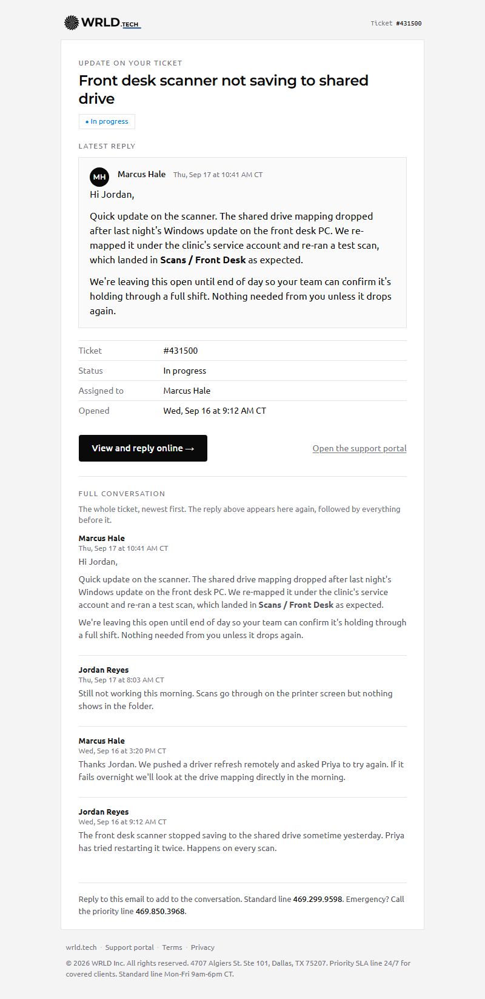

# WRLD transactional email system

Shared layout, tokens and components for every automated email WRLD sends from Syncro (helpdesk@wrld.tech), Gleap, and WHMCS/wrld.host (support@wrld.host). Built from `tokens/tokens.json`; regenerate rather than hand-editing HTML.

Spec page with live previews and copy buttons: https://claude.ai/artifact/BidZS13bTqZyNa6KWP2Poa

```
python3 email/build.py     # writes email/dist/templates and email/dist/mockups
python3 email/shots.py     # rasterizes lockups and screenshots mockups (Playwright)
python3 email/index.py     # builds the spec page email/dist/index.html
```

Directions: `ledger` (quiet), `signal` (dark header band), `thread` (conversation-first, recommended). Templates for all three are committed under `email/templates/<direction>/`.

Platform tags were verified against the live Syncro editor on 2026-09-22 (see `templates/README.md` for the list, including the tags that do not exist). `{{ticket_comment_body}}`, `{{location_logo_100}}` and `{{YEAR}}` were never real Syncro tags; the real ones are `{{comment_body}}`, `{{logo_100}}` and no year at all.

`shots.py` needs Playwright (`py -3 -m pip install playwright && py -3 -m playwright install chromium`).



# WRLD transactional email templates

Generated by build.py. Three visual directions (ledger, signal, thread) x three platforms.
Pick ONE direction and deploy its folder. Do not mix.

## One-time find and replace (all platforms)
- {{WRLD_LOGO_LIGHT_URL}}  -> hosted PNG, black lockup, transparent bg, 264x52 (2x of 132x26). Suggested: https://wrld.host/brand/email/wrld-tech-black.png
- {{WRLD_LOGO_DARK_URL}}   -> hosted PNG, white lockup, same size.
- {{WRLDHOST_LOGO_LIGHT_URL}} / {{WRLDHOST_LOGO_DARK_URL}} -> WRLD.HOST lockups (assets/wrld-host-*.png in this package).
  Syncro templates use {{location_logo_100}} instead (set the logo under Admin > Locations).
  WHMCS uses {$company_logo_url} (Setup > General Settings > General > Logo). Confirm the field appears under the editor's merge-field list; if not, hardcode the URL.
- {{YEAR}} -> Syncro has no year tag; hardcode or leave the copyright line without a year. WHMCS files already use {$date|date_format:'%Y'}.

## Syncro (helpdesk@wrld.tech)
Admin > Syncro Administration - PDF/Email Templates > Email Templates
1. Advanced (caution) > Edit HTML of Email Wrapper: paste syncro/00-email-wrapper.html. Keep {{email_body}}, {{gray_social_links}}, {{account_name}}, {{account_address}} present.
2. Edit each template, switch to HTML source, paste the matching body fragment:
   - Ticket Comment       -> syncro/ticket-comment.html   (uses {{ticket_comment_body}} + {{ticket_public_comments_for_email}})
   - Ticket Created       -> syncro/ticket-created.html
   - Ticket Autoresponder -> syncro/ticket-autoresponder.html
   - Ticket Resolved      -> syncro/ticket-resolved.html
3. Preview each template, then send a test ticket comment to yourself.
Tags used: {{ticket_number}} {{ticket_subject}} {{ticket_status}} {{tech_name}} {{ticket_date}} {{ticket_url}} {{customer_full_name}} {{customer_first_name}} {{initial_comment_body}} {{ticket_comment_body}} {{ticket_public_comments_for_email}} {{location_logo_100}} {{account_name}} {{account_address}} {{gray_social_links}} {{email_body}}.
If {{ticket_comment_body}} does not resolve in your account, the latest comment is already the first item of {{ticket_public_comments_for_email}}: remove the "Latest reply" block and rename the history label to "Conversation".

## Gleap (feedback / chat -> email)
Project > Settings > Email > Email templates
- Message reply -> select language > Source > paste gleap/message-reply.html (keeps mandatory {{{htmlContent}}} inside a <table> and {{unsubscribeLink}}).
- Ticket received / auto-reply -> gleap/auto-reply.html.
Optional: create a signature under Settings > Email > Signatures and drop its {{{signature "name"}}} variable under the Latest reply block.
Variables used: {{companyName}} {{{htmlContent}}} {{{conversationHistory}}} {{bugRef}} {{user.name}} {{profileImageUrl}} {{unsubscribeLink}} {{unsubscribeText}} {{feedbackId}} {{{formData}}} {{{screenshot}}} {{feedbackUrl}} {{receiverName}}.

## WHMCS / wrld.host (support@wrld.host)
Two paths. Choose one.

Path A - WRLD wrapper (recommended for full brand control)
1. Addons > Lagom Email Template: deactivate (or leave installed but disabled). Lagom's addon replaces the WHMCS header/footer and will fight this design.
2. Configuration > System Settings > General Settings > Mail:
   - Email Header Content: paste whmcs/00-global-email-header.html
   - Email Footer Content: paste whmcs/00-global-email-footer.html
   - Email CSS Styling: leave empty (styles are inline / in the header file).
3. Configuration > System Settings > Email Templates > edit each, Disable Rich Text Editor, paste:
   - Support Ticket Reply            -> whmcs/support-ticket-reply.html
   - Support Ticket Opened           -> whmcs/support-ticket-opened.html
   - Invoice Created                 -> whmcs/invoice-created.html
   - Invoice Payment Confirmation    -> whmcs/invoice-payment-confirmation.html
   - Invoice Payment Failed          -> whmcs/invoice-payment-failed.html
4. Upload whmcs/hooks/wrld_ticket_history.php to /includes/hooks/ to enable {$wrld_ticket_history}.

Path B - keep Lagom Email Template (fastest, less control)
1. Lagom addon > Style: Default. Set brand colors in Lagom Style Manager to mono-950 #0a0a0a primary, accent #00adee; upload the black lockup logo in Branding; footer copyright "(c) {$dateYear} WRLD Inc."; social links FB/LinkedIn/X/YouTube/Instagram.
2. Paste ONLY the *.lagom-body.html fragments into the template bodies (they carry no header/footer).
3. Still install the hook for {$wrld_ticket_history}.

Merge fields used: {$client_first_name} {$client_name} {$company_name} {$company_logo_url} {$whmcs_url} {$ticket_id} {$ticket_tid} {$ticket_subject} {$ticket_department} {$ticket_status} {$ticket_message} {$ticket_link} {$invoice_num} {$invoice_total} {$invoice_date_due} {$invoice_link} {$invoice_payment_link} {$invoice_payment_method} {$invoice_html_contents} {$date} plus custom {$wrld_ticket_history}.
Note: WHMCS does not allow changing sender or subject on support ticket templates (email piping).

## QA checklist before go-live
- Send one of each template to a Gmail, Outlook desktop (Windows), Outlook.com, Apple Mail (dark mode on) and iOS Mail.
- Confirm the logo swaps correctly in dark mode (transparent PNGs only).
- Confirm reply-by-email still threads into the ticket (Syncro "Reply above this line", WHMCS piping subject untouched).
- Check that history renders newest-first and the latest message is not duplicated.
