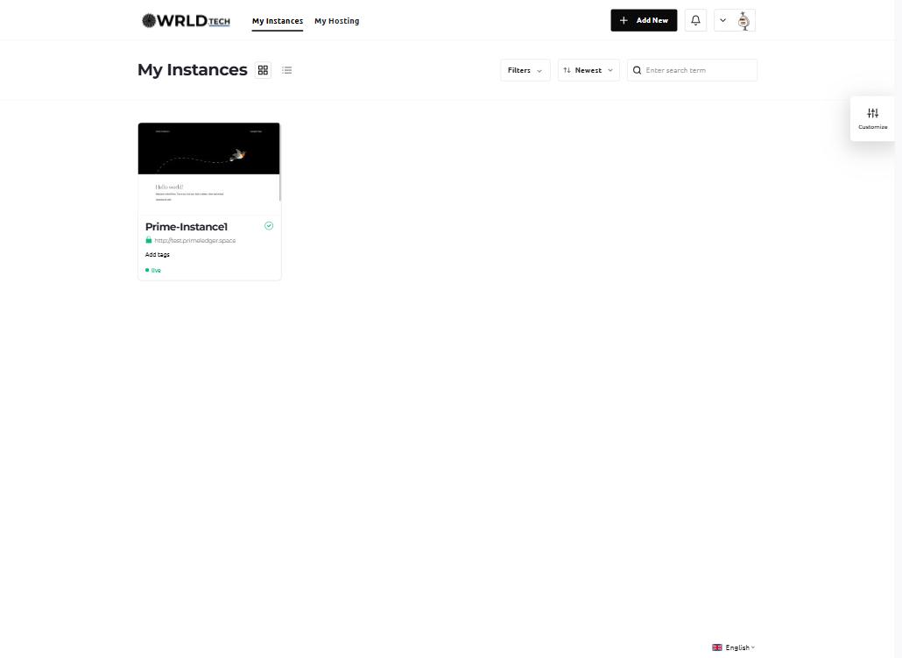
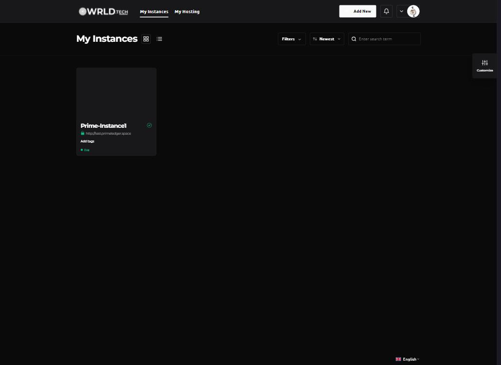

# PanelAlpha client area — WRLD branding

PanelAlpha is the WordPress hosting panel behind `deployboi.wrld.host`
(sub-brand: **wrld.host**, see `brand/wrld-host.md`). Its client area is a
Vuetify 2 app themed through `--v-*` CSS variables and a Style Manager
drawer. This folder holds everything needed to make it look like WRLD, and
records what is applied on the live panel so nobody has to reverse-engineer
it later.

| File | What it is |
| --- | --- |
| `client-area.css` | The stylesheet pasted into **Configuration → Client Area → Client Area CSS**. Fonts, WRLD tokens, light + dark variable maps, and the component overrides (buttons, cards, inputs, tabs, links). |
| `style-manager.md` | The exact values set in the client-area **Style Manager** (logos, favicon, mode switch, primary colours), plus the two alternative colour schemes with pros and cons. |

## How it is wired

```mermaid
flowchart LR
  DS[DesignSystem repo<br/>tokens · fonts · logos] -->|wrld.design CDN| CSS[client-area.css<br/>@font-face + tokens]
  DS -->|upload PNGs| SM[Style Manager<br/>logos · favicon · primary colours]
  CSS -->|Configuration → Client Area CSS| PA[PanelAlpha client area]
  SM -->|Save Changes| PA
```

- **Fonts** load from `https://wrld.design/fonts/*` (CORS open, immutable
  cache). No Google Fonts.
- **Logos** are the authentic WRLD.TECH lockups
  (`assets/logos/wrld-tech-black.png` for light mode,
  `assets/logos/wrld-tech-white.png` for dark mode). The favicon is
  `assets/logos/favicons/favicon-256x256.png`.
- **Primary colour** is the WRLD `--fg`: near-black in light mode, and the
  CSS inverts it to near-white in dark mode. Accents (`#00adee` for
  wrld.host) appear only on hover and focus, per the README's
  "accents are interactive, never decorative" rule.

## Updating

1. Edit `client-area.css` here first. It is the source of truth.
2. Preview it on the live panel before saving: open the client area, run
   `document.head.appendChild(Object.assign(document.createElement('style'), { textContent: <css> }))`
   from the console, check light and dark mode.
3. Paste the file into **Configuration → Client Area → Client Area CSS**
   and save. The field is an Ace editor bound to Vue through its `input`
   event, so a scripted `ace.edit(el).setValue(css)` alone saves nothing:
   emit the value on the wrapper (`el.__vue__.$emit('input', css)`) or
   paste by hand, then confirm `home.app.custom_css` is populated in the
   client area's Vuex store after a reload.
4. If you change a logo or the primary colours, update `style-manager.md`
   and re-apply them in the Style Manager (Branding → Configure).

## Known limits

- PanelAlpha's "Client Area Header" and "Client Area Footer" fields take
  JavaScript, not HTML. They are intentionally left empty.
- The admin area (port 8443) has no CSS hook; it keeps PanelAlpha's own
  green theme.
- Button labels ("Add New", "Save Changes") come from PanelAlpha's
  translations, so they stay Title Case. CSS cannot sentence-case them.

## Screenshots

Captured on the live panel on 2026-09-30 after the save (`screenshots/`).

| Light | Dark |
| --- | --- |
|  |  |
