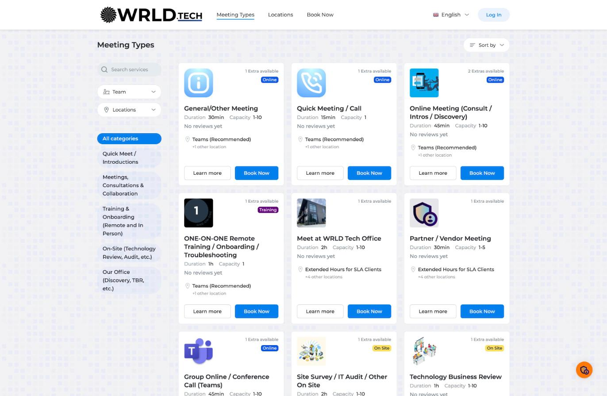
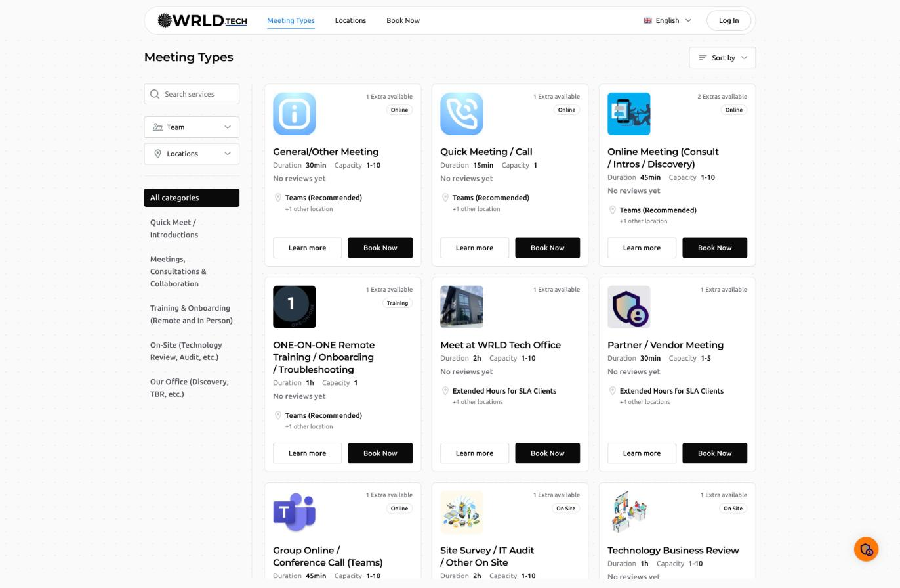
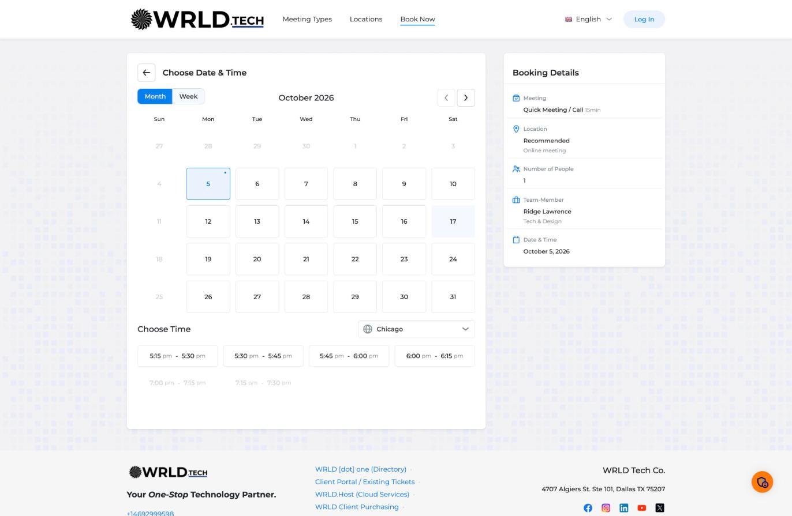
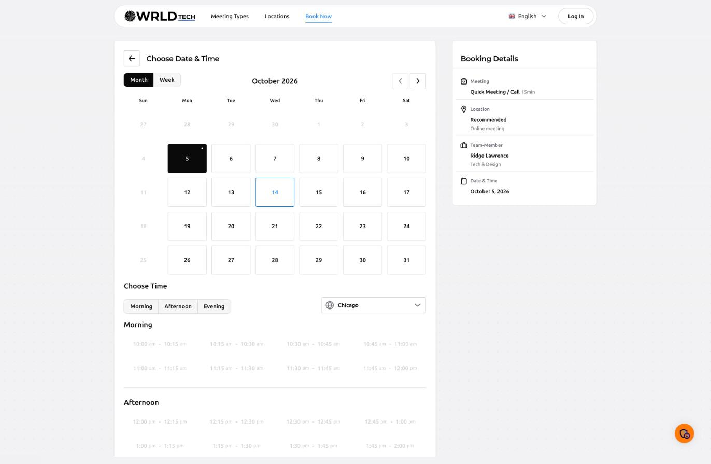
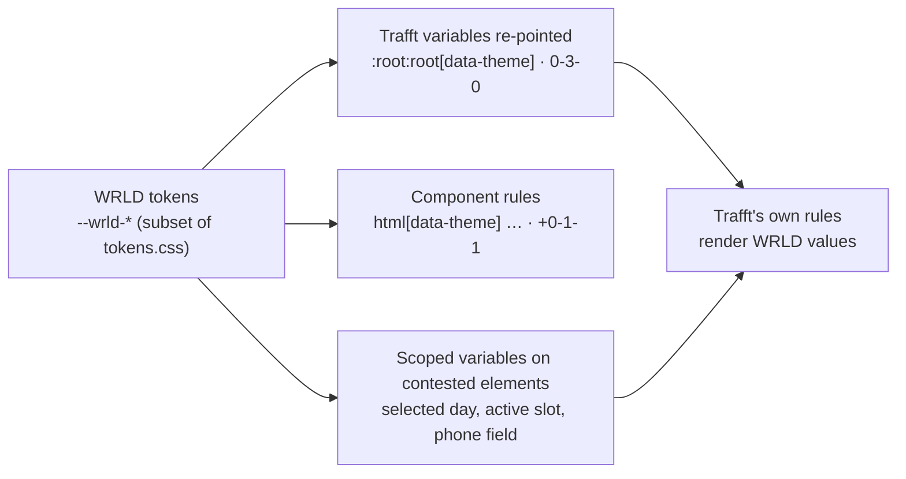

# WRLD theme for Trafft — calendar.wrld.tech

The booking site at <https://calendar.wrld.tech> runs on Trafft. Trafft exposes two
override fields — **Custom CSS** and **Custom JS** — under
*Customize → Booking Website → Custom Code*. The two files here fill them and bring
the site onto the WRLD design system: monochrome surfaces, Ubuntu body and
Montserrat display type, 4/8/12px radii, and `#007fee` only on hover, focus and
selection.

| File | Field | Required |
| --- | --- | --- |
| [`custom.css`](custom.css) | Custom CSS | Yes |
| [`custom.js`](custom.js) | Custom JS | No — the CSS stands alone |

| Before | After |
| --- | --- |
|  |  |
|  |  |

Also: [customer info form](screenshots/after-customer-info.jpg) · [dark theme](screenshots/after-services-dark.jpg) · [390px phone](screenshots/after-mobile.jpg).
Visual proof page: <https://claude.ai/artifact/VFiAXPB4m1LLaiAwwhWcWZ> (private — shared from the page's Share menu).

## Install

1. Open <https://calendar.admin.wrld.tech/customize/booking-website/custom-code>.
2. Replace the whole **Custom CSS** field with `custom.css`. The Gleap rule that
   lived there before is carried over at the bottom of the file — nothing is lost.
3. Optional: paste `custom.js` into **Custom JS**, wrapped as
   ``. Trafft writes this field into `<head>` with
   postscribe, which parses HTML, so bare JavaScript is stored but never runs.
   To follow the visitor's OS light/dark setting, set `followSystemTheme: true`
   at the top of the file.
4. Edit the fields by typing. A scripted value change does not raise the
   *Save Changes* bar. Then save, hard-refresh <https://calendar.wrld.tech>,
   and run the checks below.

To roll back, restore the previous CSS (the four-line Gleap media query, now
section 11 of `custom.css`) and clear Custom JS.

## How it overrides Trafft

Trafft links the custom stylesheet **first** in `<head>`, ahead of roughly 70 of
its own sheets, so Trafft wins every specificity tie. Its components are
Vue-scoped (`.x[data-v-hash]`, 0-2-0) and its hover rules stack `:not()` chains
up to 0-7-0. The file stays ahead without blanket `!important`:

1. **Variable remap.** `--color-primary`, the grey scale, `--theme-*`, `--elevation-*`
   and the Element Plus primaries are re-pointed at `:root:root[data-theme]`
   (0-3-0), above Trafft's `:root[data-theme=light]` (0-2-0). Most of the re-theme
   happens here. `--color-primary` becomes `--wrld-fg`; its `-90` and `-25` steps,
   which Trafft uses for focus borders and rings, become `#007fee`.
2. **Scoped component rules.** Everything else sits under `html[data-theme]`, which
   adds 0-1-1 to a selector of the same shape as Trafft's.
3. **Variables on the element.** Where a Trafft state rule is too specific to beat,
   or uses `!important` through a variable (the phone field), the file sets Trafft's
   variables on that element. A custom property declared on an element always beats
   the inherited `:root` value, so Trafft's own rule renders the WRLD value.

Trafft writes `data-theme="light|dark"` to `<html>` — the same switch WRLD tokens key
off — so the dark theme comes along. It is tested on the services, booking (every
step), service detail and locations pages.

## What the theme changes

- **Header** — the floating hairline pill from wrld.design; nav links turn blue on
  hover and when active; the mobile menu becomes a floating 12px card.
- **Buttons** — primary is an `--wrld-fg` fill with the blue shadow lift on hover
  (`ui_kits/wrld-tech/Button.jsx`); *Learn more* and *Log in* are hairline
  secondaries. No focus ring after a mouse click; the 3px WRLD ring on keyboard focus.
- **Cards** — hairline borders instead of drop shadows; service cards take the
  accent border and lift on hover, as on the wrld.design landing page.
- **Badges** — Online / Training / On Site render as the WRLD default pill:
  monochrome, hairline, 9999px.
- **Calendar and time slots** — 4px cells; hover is a blue border; the selected day
  and slot are solid `--wrld-fg` fills.
- **Forms** — 4px fields, `--wrld-border-strong` hairline, blue border with a 3px ring
  on focus. Trafft's red error state is untouched.
- **Background** — the uploaded background image is replaced by the WRLD dot grid
  (`rgb(0 0 0 / 0.06)` at 24px), which the brand allows on technical surfaces.
- **Footer** — mono links that turn blue on hover; social icons rest in grayscale.

## Admin settings this makes inert

The CSS takes precedence over these *Theme and Appearance* settings, so changing
them in the admin has no visible effect while it is installed:
**primary color** (`#027FEE`), **background theme color** (`#F2F2F4`),
**font** (Montserrat), **website background image**, and the per-service
**badge colours**. *Interface appearance* (Light / Dark) still works.

## Recommended label changes (admin → Labels)

WRLD UI copy is sentence case. CSS cannot change case safely, so set these under
*Customize → Labels*: *Book Now → Book now*, *Meeting Types → Meeting types*,
*Log In → Log in*, *Choose Service → Choose service*, *Choose Date & Time →
Choose date & time*, *Booking Details → Booking details*, *Customer Info →
Customer info*, *Choose Location / Employee / Extras / Time → sentence case*.

## Checks after saving

- [ ] `https://calendar.wrld.tech/api/v1/public/custom.css?id=__nuxt` returns this file.
      Trafft keeps `@font-face` and `url()` and only converts line endings to CRLF
      (verified 2026-10-05).
- [ ] The Custom JS ran: on the live site, `window.__wrldTrafftTheme === true` and
      `<meta name="theme-color">` reads `#ffffff`.
- [ ] Body text renders in Ubuntu (DevTools → Computed → `font-family`: `"WRLD Ubuntu"`).
- [ ] Services: the card hover shows the blue border and lift; *Book now* is near-black.
- [ ] Booking: the selected day and slot are solid; a field left empty shows a red border.
- [ ] Phone width (≤ 580px): the header pill, the floating menu, and the Gleap AI input hidden.

## Maintenance

- Token values in section 1 mirror `tokens/tokens.css` v0.1.0. Change them here when
  the tokens change. The file is self-contained on purpose: a booking page should
  not depend on a second origin for its colours.
- Fonts load from `https://wrld.design/fonts/` (CORS open, cached a year). A
  `wrld.design` outage degrades to system Ubuntu or `system-ui`; nothing breaks.
- Trafft ships hashed class names for scoped styles (`data-v-*`) but stable block
  names (`ui-button`, `booking-ts`, `bs-*`). The file targets only the stable names.
  After a Trafft release, re-run the checks above.
